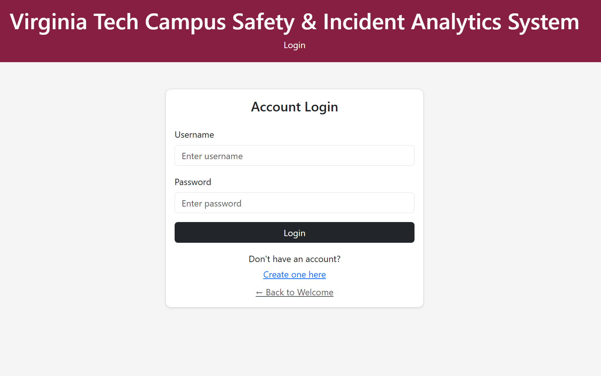
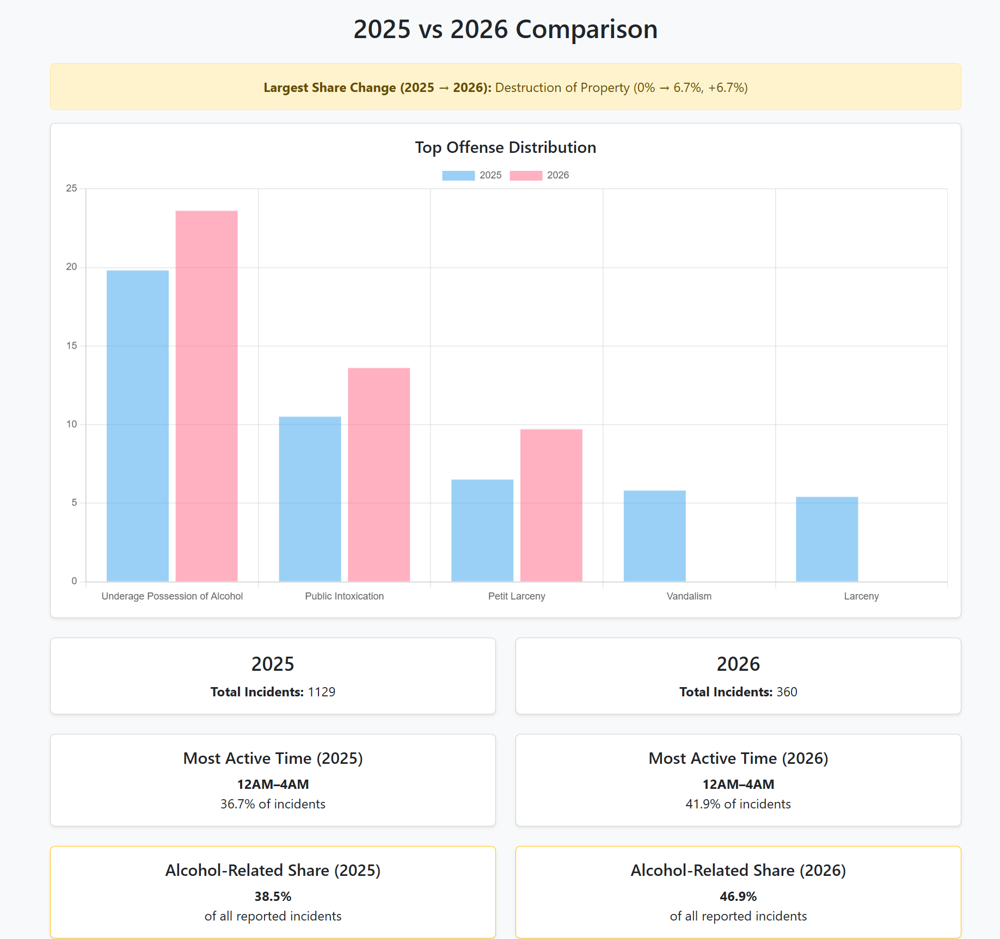

Virginia Tech Campus Safety & Incident Analytics System

A full-stack web application designed to collect, store, and analyze campus crime data from Virginia Tech police logs. This system acheives PDF data ingestion, stores structured records in a MySQL database, and provides an interactive web interface for querying and visualizing incidents.

---

Project Overview

This project was developed as part of a database systems course to demonstrate:

- Relational database design
- Data ingestion from unstructured sources (PDFs)
- Backend development with Flask
- Frontend visualization and analytics

The system transforms raw campus police logs into a structured, queryable format and provides meaningful insights into campus safety trends.

---

Tech Stack

- Backend: Python (Flask)
- Database: MySQL
- Frontend: HTML, CSS, Jinja Templates
- Data Processing: pandas, pdfplumber
- Visualization: Chart.js
- Environment Management: python-dotenv

---

Features

Data Ingestion
- Parses monthly campus police PDF logs
- Extracts:
  - Case number
  - Date reported
  - Offense type
  - Location
  - Occurrence date/time
  - Disposition
- Prevents partial inserts (ensures data integrity)

---

Relational Database Design
- Normalized schema with:
  - `incident`
  - `offense`
  - `location`
  - `disposition`
  - `incident_offense` (junction table)

---

Web Interface
- View all incidents
- Filter incidents by year (2024–2026)
- Sort by:
  - Date
  - Offense
  - Location
- Clean tabular display using Jinja templates

---

Analytics Dashboard
- Total incidents count
- Top 3 most common offenses
- Most active time ranges (4-hour intervals)
- Charts powered by Chart.js:
  - Offense frequency
  - Time-of-day distribution

---

Data Integrity & Access Control

- Role-based access system:
  - **Administrators** can add, edit, and delete records
  - **Regular users** have read-only access to incident data
---

Screenshots

Welcome Page

2026 Incidents Table

Analytics View

*(Add screenshots in a `/screenshots` folder and update paths as needed)*

---

Setup Instructions
---
To run the Campus Safety & Incident Analytics System locally from scratch, the following tools and setup steps are required.

Required Software
Python 3.11 or 3.12
MySQL Server (MySQL Workbench recommended)
Visual Studio Code (recommended) or another Python-compatible IDE
Installation Steps

1. Clone the Repository
Clone the project repository and move into the project directory.

git clone https://github.com/walexross2022/4604CampusSafetySystem.git
cd 4604CampusSafetySystem

2. Create and Activate a Virtual Environment
Create a Python virtual environment to isolate project dependencies.

python -m venv venv
venv\Scripts\activate

On macOS/Linux, use source venv/bin/activate instead.

3. Install Required Dependencies
Install all required Python packages for the backend application, database connection, authentication, and PDF parsing.

pip install flask mysql-connector-python pdfplumber python-dotenv bcrypt

4. Configure Environment Variables
Create a .env file in the project root and add the following values:

DB_HOST=localhost 
DB_PORT=3306 
DB_USER=root 
DB_PASSWORD=yourpassword
SECRET_KEY=yoursecretkey
DB_PASSWORD=CampusSafety 
DB_NAME=incident_reporting

This file stores database connection settings and the Flask secret key used by the application.
Sensitive values should never be hardcoded in source files or committed to version control.

5. Start MySQL
Start the MySQL server and ensure it is running on port 3306.
You can verify the server is active by opening MySQL Workbench or connecting through the command line.

6. Initialize the Database

Create the database schema using the SQL definitions stored in db/currentDB.txt.

After initializing the schema, populate the database using the provided parser scripts in the project root. These scripts parse official campus crime log PDFs and insert cleaned records into the relational database.

Example loader scripts include:
load_pdf_testdata.py
temp2025Loader.py
LCI2026pdfs.py

Or load data via the GUI

7. Run the Flask Application
Start the backend server from the project root.
python backend/app.py
8. Open the Application
Once the Flask server is running, open a browser and navigate to:
http://127.0.0.1:5000

The application should now be running locally.
