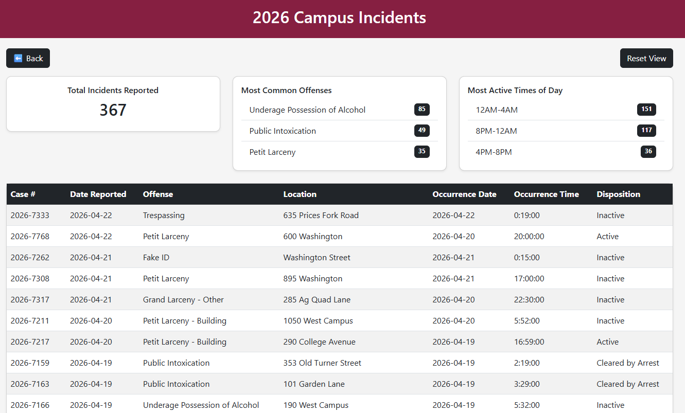
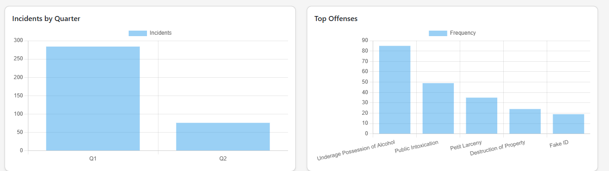

Virginia Tech Campus Safety & Incident Analytics System

A full-stack web application designed to collect, store, and analyze campus crime data from Virginia Tech police logs. This system acheives PDF data ingestion, stores structured records in a MySQL database, and provides an interactive web interface for querying and visualizing incidents.

---

Project Overview

This project was developed as part of a database systems course to demonstrate:

- Relational database design
- Data ingestion from unstructured sources (PDFs)
- Backend development with Flask
- Frontend visualization and analytics

The system transforms raw campus police logs into a structured, queryable format and provides meaningful insights into campus safety trends.

---

Tech Stack

- Backend: Python (Flask)
- Database: MySQL
- Frontend: HTML, CSS, Jinja Templates
- Data Processing: pandas, pdfplumber
- Visualization: Chart.js
- Environment Management: python-dotenv

---

Features

Data Ingestion
- Parses monthly campus police PDF logs
- Extracts:
  - Case number
  - Date reported
  - Offense type
  - Location
  - Occurrence date/time
  - Disposition
- Prevents partial inserts (ensures data integrity)

---

Relational Database Design
- Normalized schema with:
  - `incident`
  - `offense`
  - `location`
  - `disposition`
  - `incident_offense` (junction table)

---

Web Interface
- View all incidents
- Filter incidents by year (2024–2026)
- Sort by:
  - Date
  - Offense
  - Location
- Clean tabular display using Jinja templates

---

Analytics Dashboard
- Total incidents count
- Top 3 most common offenses
- Most active time ranges (4-hour intervals)
- Charts powered by Chart.js:
  - Offense frequency
  - Time-of-day distribution

---

Data Integrity & Access Control

- Role-based access system:
  - **Administrators** can add, edit, and delete records
  - **Regular users** have read-only access to incident data
---

Screenshots

Homepage


All Incidents Table


Analytics View


*(Add screenshots in a `/screenshots` folder and update paths as needed)*

---

Setup Instructions

1. Clone Repository

```bash
git clone https://github.com/your-username/4604CampusSafetySystem.git
cd 4604CampusSafetySystem
